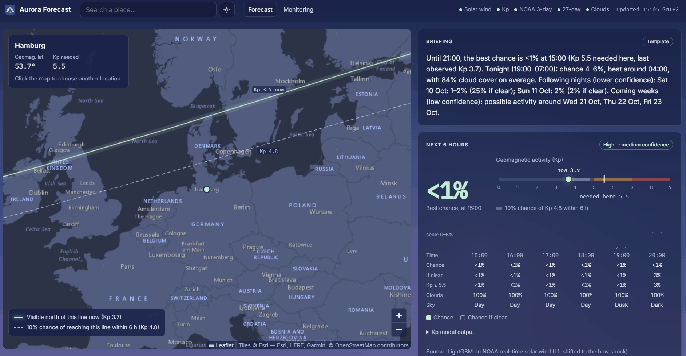
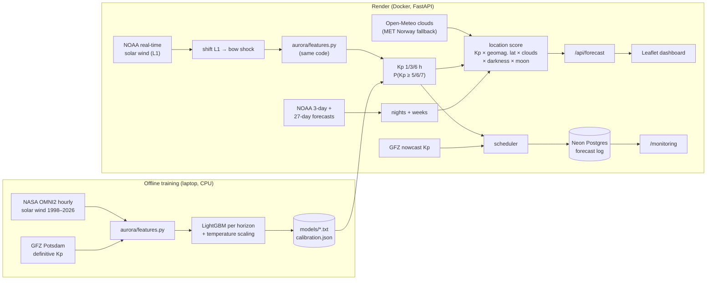
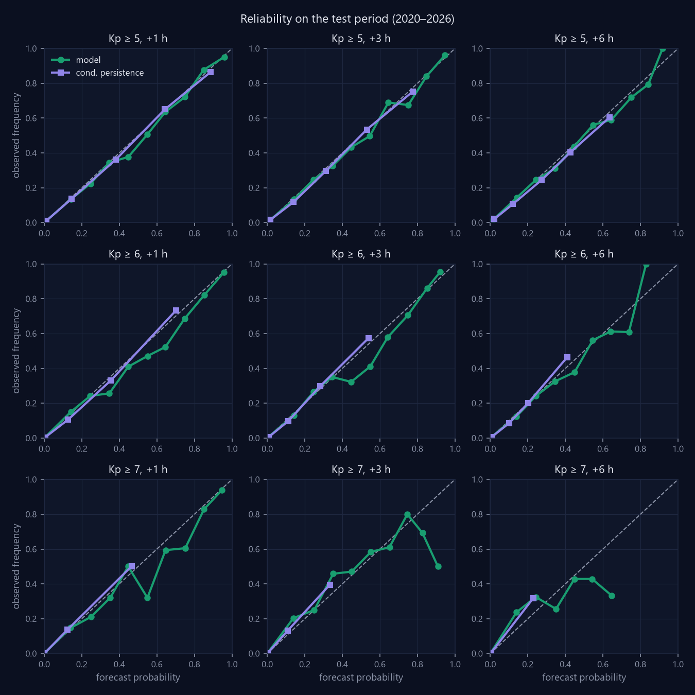
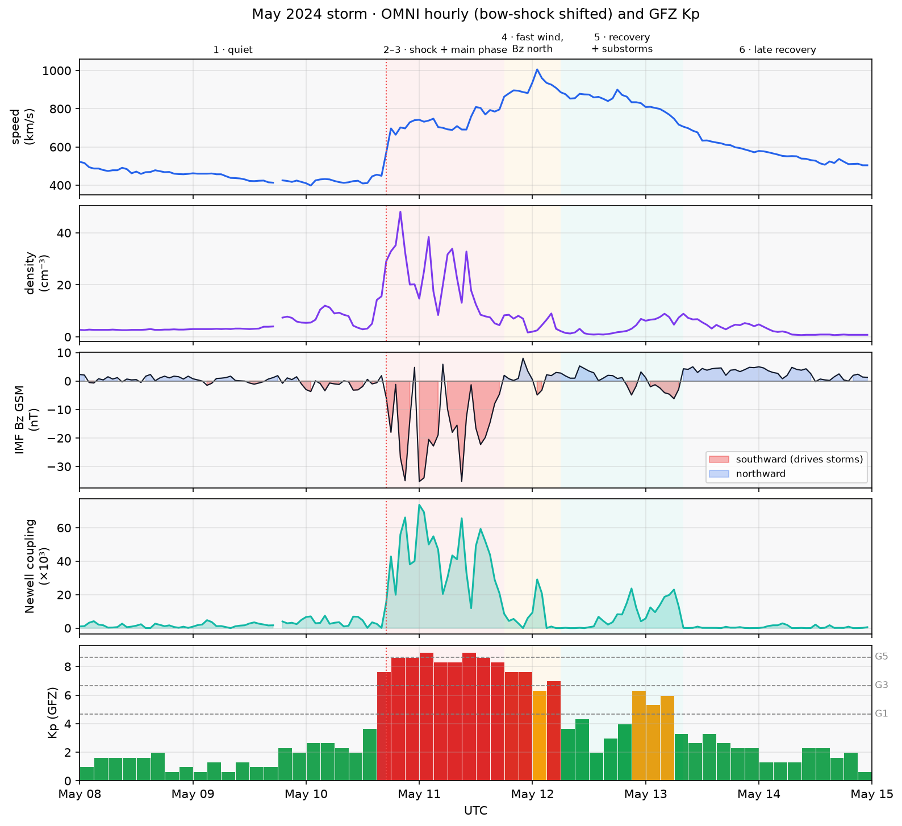

# Aurora Forecast

**Live:** https://aurora-forecast-zqnk.onrender.com · [Monitoring](https://aurora-forecast-zqnk.onrender.com/monitoring)

Chance of seeing the aurora at a chosen place, tuned for Europe: the next hours, the
next 3 nights, and a low-confidence hint for the coming weeks. Each horizon uses the source
that actually has skill at that range, and the confidence shown falls with the horizon.



## What it does

| Horizon | Source | Why this source | Shown as |
|---|---|---|---|
| Now and next 1–6 h | **LightGBM** forecasting Kp from real-time L1 solar wind | L1 is ~1.5 million km upstream, so the solar wind that hits Earth in the next 30–60 min is already measured. | Exact values, solid bars |
| Next 3 nights | **NOAA SWPC 3-day Kp forecast**, calibrated on its own archive | Storms days ahead come from CMEs still between Sun and L1. NOAA sees them with coronagraphs; L1 data cannot. | Ranges, softer styling |
| Next ~4 weeks | **27-day solar rotation** and NOAA's 27-day outlook | Coronal-hole streams recur every ~27 days; CMEs do not. | Text only, dashed |

For the chosen place, the forecast Kp is combined with geomagnetic latitude (how much
activity this place needs), cloud cover by layer, darkness and the moon. The map shows
the **view line**: north of it, the aurora may be visible on the northern horizon right now.

`/monitoring` logs every live forecast and scores it against the Kp observed later.

## Architecture



Training and serving share one feature module, so live features are computed exactly
like the training features. Live solar wind is measured at L1 while OMNI is shifted to
the bow shock, so live data is time-shifted by the spacecraft distance / speed first.

## Results

Test period 2020 – Aug 2026 (rise and maximum of Solar Cycle 25, including the May and
October 2024 storms). Brier skill score vs climatology, 95% CI from a 7-day block bootstrap.
*Conditional persistence* (P(future class | current class), learned on train) is the
strongest baseline; plain persistence and 27-day recurrence score below zero.

| Horizon | Kp ≥ 5 | | Kp ≥ 7 | |
|---|---|---|---|---|
| | **Model** | Cond. persistence | **Model** | Cond. persistence |
| +1 h | **0.45** [0.39, 0.49] | 0.28 | **0.44** [0.29, 0.54] | 0.28 |
| +3 h | **0.32** [0.27, 0.36] | 0.19 | **0.27** [0.14, 0.36] | 0.18 |
| +6 h | **0.21** [0.16, 0.25] | 0.12 | 0.11 [0.05, 0.15] | 0.10 |

- The model beats every baseline at every horizon, except Kp ≥ 7 at +6 h, where it ties.
- Skill falls with lead time, as the physics predicts. This is why the app hands over to
  NOAA for the nights.
- Probabilities are calibrated (reliability below), and P(Kp≥7) ≤ P(Kp≥6) ≤ P(Kp≥5) holds by
  construction: they are tail sums of one multiclass model.
- NOAA's 3-day forecast, scored on 1,248 archived issues: day 1 is no better than persistence;
  days 2–3 beat persistence and recurrence clearly, but modestly.

Full numbers, storm-window and event-based scores and feature importance are in
[MODEL_CARD.md](MODEL_CARD.md).

<p align="center">
  
</p>

<details>
<summary>May 2024 storm in the training data (OMNI solar wind and GFZ Kp)</summary>



</details>

## Limitations

- **Big storms arrive without warning at +3 h.** The largest sudden-commencement storms in
  the test set (May 10 2024, Oct 10 2024, Nov 12 2025, Jan 19 2026) got P(Kp ≥ 6) < 0.01
  three hours ahead. A CME shock reaches L1 only 30–60 min before Earth. This is a physical
  limit, not a tuning problem.
- **The location "chance" is a score, not a probability.** Only the Kp part is calibrated;
  clouds, darkness and the moon are heuristic weights.
- **Train/serve skew.** Training uses definitive GFZ Kp and OMNI data; live inputs are NOAA's
  estimated Kp and raw L1 data shifted by an estimated delay. The live spacecraft also
  switches between SWFO-L1, ACE and IMAP.
- **Few extreme events.** Kp ≥ 7 is ~0.5% of test hours, so its confidence intervals are wide and
  its calibration rests on few storms.
- **Kp is planetary.** Local visibility also depends on substorm timing within the 3-hour
  interval. The Kp-needed thresholds are tuned for Central Europe. Any place in the world
  can be searched, including the southern hemisphere (aurora australis), but the simple
  dipole model is a few degrees off in the UK and North America, and outside Europe the app
  says the thresholds are less accurate. The map lines cover the northern hemisphere only.
- **Live monitoring is provisional.** It uses GFZ nowcast Kp and, after a few weeks without
  storms, says little about skill at high Kp.
- **Free hosting.** 0.1 CPU and 512 MB RAM on Render; a cold start can take ~1 min if the
  service has slept.

## Production

- **FastAPI** serves the API and the static frontend (plain HTML/CSS/JS, **Leaflet**, Esri
  dark tiles). No build step.
- **Docker** image built and smoke-tested in **GitHub Actions** (ruff, 135 tests with all
  external feeds mocked). **Render** deploys `main` after CI passes.
- **Monitoring:** an in-process scheduler logs each forecast and the observed Kp to
  **Neon Postgres**; `/monitoring` shows Brier scores and skill vs persistence and climatology.
- **Resilience:** each feed failing only blanks the panel that needs it. Clouds fall back
  from Open-Meteo to MET Norway (Render's shared IP hits Open-Meteo's rate limit).
- **Ops:** Sentry for errors, UptimeRobot on `/health`.
- **Briefing:** optional LLM text (Claude Haiku) from structured facts only, cached, with a
  template fallback. The deployed app uses the free template.

## Run locally

```powershell
python -m venv .venv
.venv\Scripts\pip install -e ".[dev]"
.venv\Scripts\python -m uvicorn app.main:app --port 8000
```

Open http://localhost:8000. Settings are in `.env` (see `.env.example`); all are optional.
Without `DATABASE_URL` the forecast log is a local SQLite file.

```powershell
.venv\Scripts\python -m pytest -m "not network"   # offline tests
.venv\Scripts\python -m pytest -m network         # checks live feed formats
```

### Retrain from scratch

```powershell
python scripts/download_data.py    # OMNI2 + GFZ Kp
python scripts/build_dataset.py
python scripts/train.py            # models/kp_h{1,3,6}.txt + calibration.json
python scripts/evaluate.py         # reports/metrics.json + figures
python scripts/evaluate_noaa.py    # NOAA 3-day forecast scores
```

## Repository

```
aurora/          shared package: data loaders, features, model, physics, location score
app/             FastAPI app, scheduler, DB, static frontend
scripts/         download, build, train, evaluate
models/          trained boosters and calibration (small, committed)
reports/         metrics and figures
notebooks/       EDA
tests/           pytest, with saved feed fixtures
```

## Data credits

NASA/GSFC OMNIWeb (OMNI2), GFZ Potsdam (Kp, CC BY 4.0), NOAA SWPC, Open-Meteo (CC BY 4.0),
MET Norway (CC BY 4.0), Esri and OpenStreetMap contributors (map tiles).
